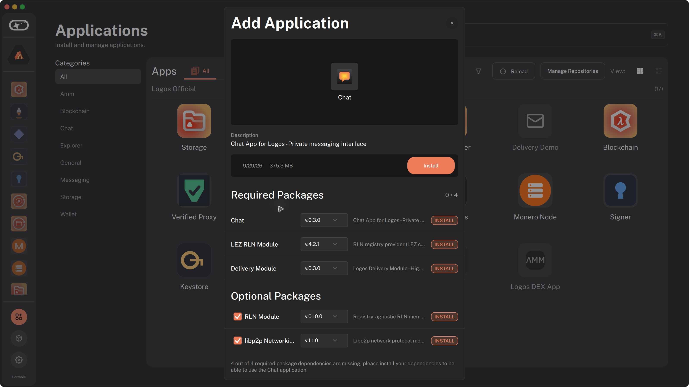
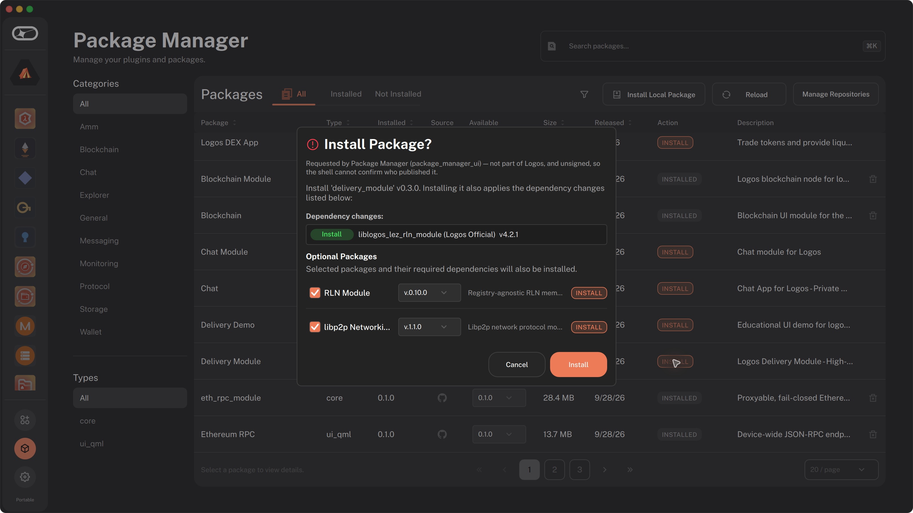

# Optional package installation

The reported installation screens omitted optional dependencies, including
those declared by an application's required modules:

The updated dialogs show available optional packages checked by default and
unavailable ones unchecked and disabled. Optional rows use the required-package
layout, including resolved versions, version selectors, descriptions and status
badges, with a checkbox to select each package. The following captures render the real
QML components with test fixtures for available and unavailable packages; they
are not end-to-end installation captures:

The following captures use the rebuilt portable macOS application, the live
catalog, and the default user directory. They verify the resolved previews;
no packages were installed during this check.

With RLN selected, Chat has four required packages, including LEZ RLN 4.2.1.
The required list scrolls to show the fourth row, Chat Module:

Unchecking RLN removes its exclusive LEZ RLN dependency. Chat, Chat Module,
and Delivery Module remain required, and libp2p remains selected:

Installing Delivery Module directly also includes the selected RLN module's
mandatory LEZ RLN dependency in the confirmation:

