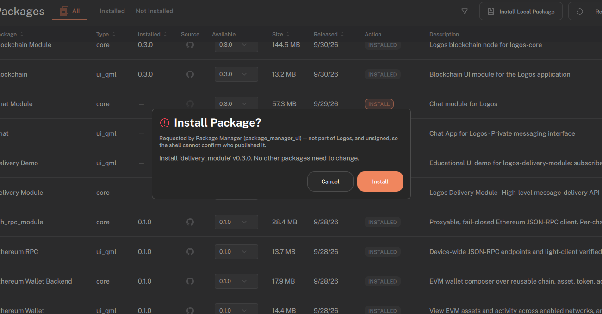
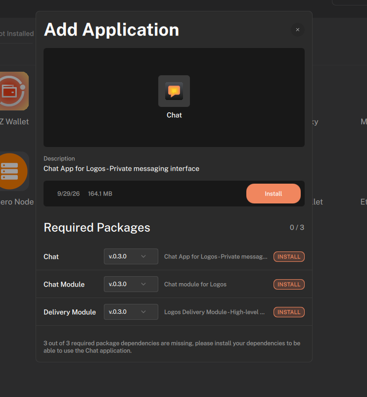
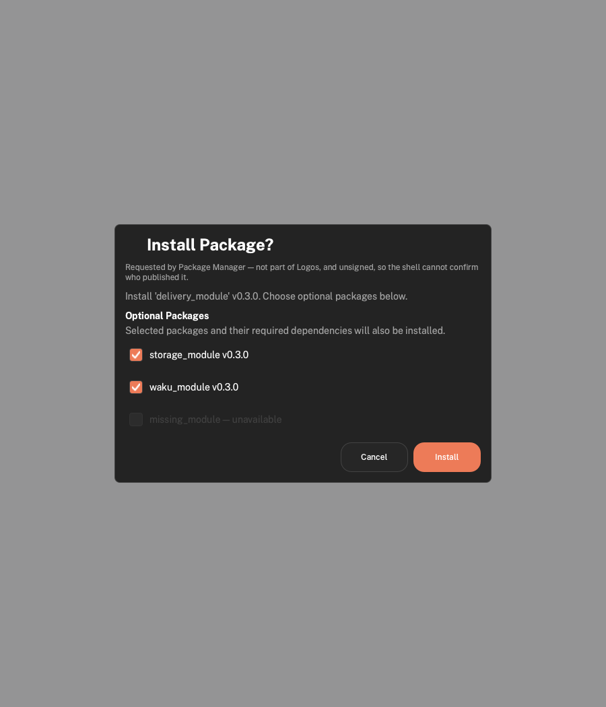
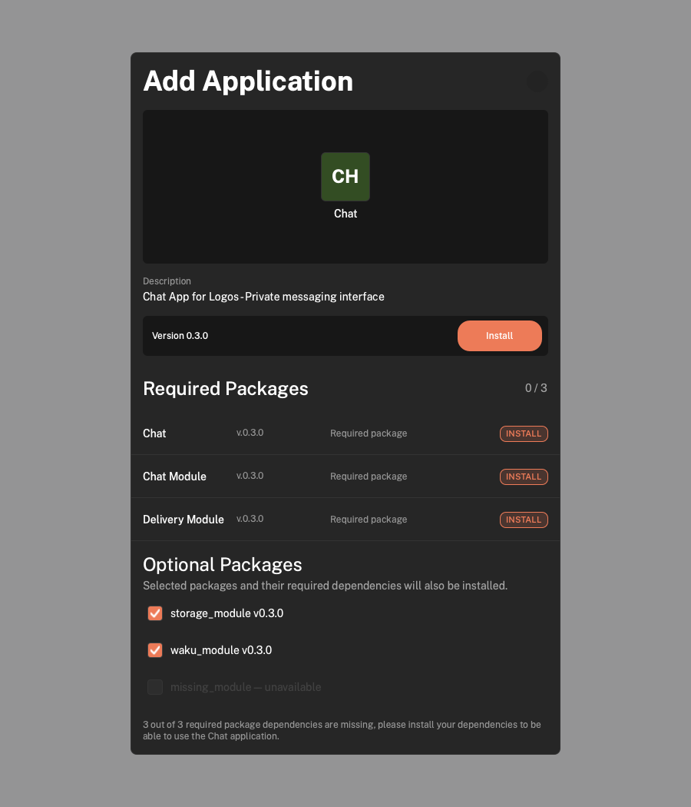

# Optional package installation

The reported installation screens omitted optional dependencies, including
those declared by an application's required modules:

The updated dialogs show available optional packages checked by default and
unavailable ones unchecked and disabled. The following captures render the real
QML components with test fixtures for available and unavailable packages; they
are not end-to-end installation captures:

